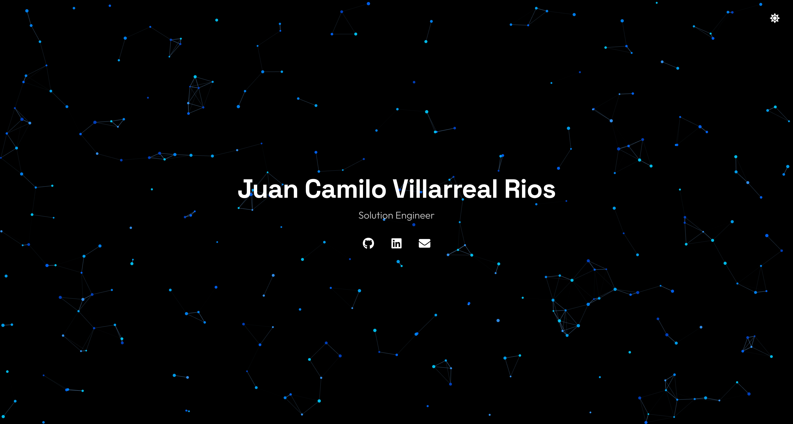

# Juan Camilo Villarreal Rios

Personal website built with React, TypeScript, and Vite.



## Features

- Interactive particle background with blue theme
- Dark/Light mode toggle
- Subtle sound effects on interactions
- Responsive design
- Social links (GitHub, LinkedIn, Instagram, Email)

## Tech Stack

- React 18
- TypeScript
- Vite
- tsParticles
- React Icons
- Web Audio API (sounds)

## Project Structure

```
src/
├── components/          # React components
│   ├── ParticlesBackground.tsx
│   ├── SocialLinks.tsx
│   ├── ThemeToggle.tsx
│   └── index.ts
├── hooks/               # Custom React hooks
│   ├── useSound.ts
│   └── index.ts
├── styles/              # CSS styles
│   └── index.css
├── types/               # TypeScript types
│   └── index.ts
├── App.tsx              # Main app component
├── main.tsx             # Entry point
└── vite-env.d.ts
```

## Getting Started

1. Clone this repository:
```bash
git clone git@github.com:juancv3d/My_Website.git
```

2. Install dependencies:
```bash
npm install
```

3. Start the development server:
```bash
npm run dev
```

4. Open [http://localhost:3000](http://localhost:3000)

## Build

```bash
npm run build
```

## Live Site

[https://juancamilo.dev](https://juancamilo.dev)

## License

MIT
