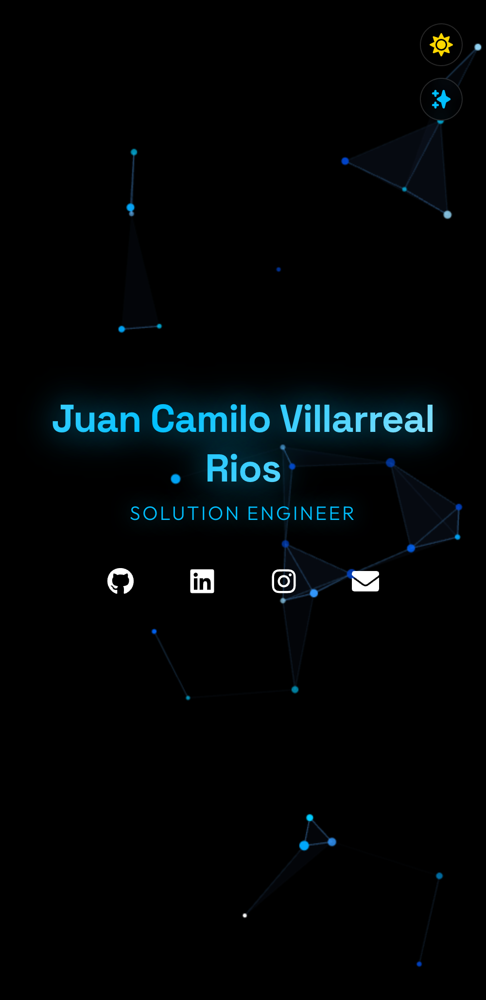
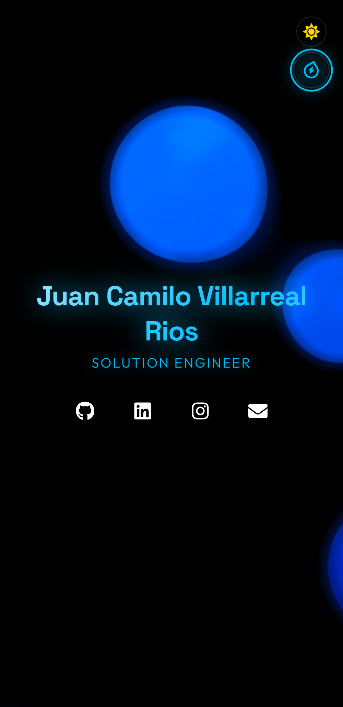
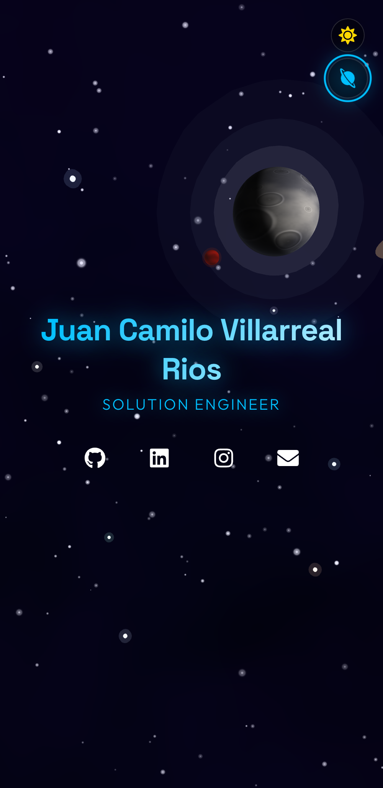

# Juan Camilo Villarreal Rios

> **Solution Engineer** specializing in data analytics, cloud solutions, and modern web technologies

Personal portfolio website featuring interactive 3D backgrounds and modern UI design.

🌐 **Live Site:** [https://juancamilo.dev](https://juancamilo.dev)

---

## 🎨 Interactive Themes

Switch between three unique animated backgrounds by clicking the theme button (top right):

### **1. Particles Theme** ⚛️


Interactive atomic particles that respond to your cursor:
- Particles connect with nearby neighbors via dynamic lines
- Click anywhere to spawn new particles
- Collision physics simulation
- Smooth Brownian motion
- **Best for:** Minimalist, tech-focused aesthetic
- **Default theme**

### **2. Fluid Theme** 💧


Viscous blue lava lamp with realistic physics:
- Smooth, dense blob movement (55% slower than normal)
- Vertical color gradient (cyan → deep blue)
- Click to create bubbles that rise slowly
- Internal flowing textures (FBM noise)
- Gyroscope support on mobile (tilt to move blobs)
- Mouse heat zones that expand nearby blobs
- **Best for:** Mesmerizing, organic visuals

### **3. Space Theme** 🌌


Immersive 3D space scene with:
- Procedural nebula background
- Sun (day mode) / Moon (night mode) with realistic shaders
- 4 orbiting planets including Mars
- 500+ twinkling stars with parallax
- Interactive black hole (press & hold anywhere)
  - Gravitational lensing effect
  - Stars spiral into the center
  - Orange/gold Interstellar-style ring
- Gyroscope parallax on mobile
- Shooting stars
- **Best for:** Immersive, cinematic experience

---

## ✨ Features

### 🎯 **User Experience**
- Dark/Light mode toggle
- Mobile-optimized with gyroscope parallax
- Smooth theme transitions
- Subtle sound effects
- Fully responsive design

### 🚀 **SEO & Performance**
- Complete meta tags for search engines
- Open Graph & Twitter Cards for social previews
- Structured Data (JSON-LD)
- Sitemap & robots.txt
- Optimized performance

---

## 🛠️ Tech Stack

### **Frontend**
- **React 18** - UI framework
- **TypeScript** - Type safety
- **Vite** - Build tool & dev server
- **Three.js & @react-three/fiber** - 3D graphics

### **Styling & UI**
- Custom CSS with glassmorphism effects
- React Icons
- Google Fonts (Space Grotesk, Outfit)

### **Interactions**
- Web Audio API - Sound effects
- tsParticles - Particle system
- Device Orientation API - Gyroscope
- GLSL Shaders - Custom visual effects

### **Deployment**
- GitHub Actions - CI/CD
- GitHub Pages - Hosting
- Custom domain

---

## 📁 Project Structure

```
mywebsite/
├── public/
│   ├── favicon.svg          # Minimalist "JC" logo
│   ├── robots.txt           # Search engine rules
│   ├── sitemap.xml          # Site structure
│   └── CNAME                # Custom domain
│
├── src/
│   ├── components/
│   │   ├── backgrounds/
│   │   │   ├── ParticlesBackground.tsx   # Particles theme
│   │   │   ├── FluidBackground.tsx       # Lava lamp theme
│   │   │   ├── SpaceBackground.tsx       # 3D space theme
│   │   │   └── index.ts
│   │   ├── BackgroundRenderer.tsx        # Theme switcher logic
│   │   ├── BackgroundSelector.tsx        # Theme toggle button
│   │   ├── ThemeToggle.tsx               # Dark/light mode button
│   │   ├── SocialLinks.tsx               # Social media links
│   │   └── index.ts
│   │
│   ├── context/
│   │   ├── BackgroundContext.tsx         # Global theme state
│   │   └── index.ts
│   │
│   ├── hooks/
│   │   ├── useSound.ts                   # Sound effects hook
│   │   └── index.ts
│   │
│   ├── styles/
│   │   └── index.css                     # Global styles
│   │
│   ├── types/
│   │   └── index.ts                      # TypeScript definitions
│   │
│   ├── App.tsx                            # Main component
│   ├── main.tsx                           # Entry point
│   └── vite-env.d.ts                     # Vite types
│
├── .github/
│   └── workflows/
│       └── deploy.yml                    # GitHub Actions CI/CD
│
├── index.html                            # HTML template with SEO
├── package.json                          # Dependencies
├── tsconfig.json                         # TypeScript config
├── vite.config.ts                        # Vite config
├── SEO-README.md                         # SEO setup guide
└── README.md                             # This file
```

For detailed technical architecture, see [ARCHITECTURE.md](./ARCHITECTURE.md)

---

## 🚀 Getting Started

### Prerequisites
- Node.js 18+ 
- npm or yarn

### Installation

1. **Clone the repository**
```bash
git clone git@github.com:juancv3d/My_Website.git
cd My_Website
```

2. **Install dependencies**
```bash
npm install
```

3. **Start development server**
```bash
npm run dev
```

4. **Open in browser**
```
http://localhost:3000
```

### Build for Production

```bash
npm run build
```

The production build will be in the `dist/` directory.

### Preview Production Build

```bash
npm run preview
```

---

## 🎨 Theme Details

### **1. Particles Theme**
- Interactive atomic particles
- Click to spawn new particles
- Particle collision and physics
- Connects with mouse cursor
- Default theme

### **2. Fluid Theme**
- Viscous lava lamp effect
- Blue gradient (cyan → deep blue)
- Click to create bubbles
- Gyroscope tilt on mobile
- Internal flowing textures
- Dense, slow movement

### **3. Space Theme**
- 3D nebula background
- Sun/Moon based on dark/light mode
- 4 orbiting planets (including Mars)
- Interactive black hole (press & hold)
- Stars with gravitational attraction
- Gyroscope parallax on mobile
- Shooting stars

---

## 🔧 Customization

### Change Colors
Edit `src/styles/index.css`:
```css
:root {
  --color-accent: #00aaff;          /* Primary accent */
  --color-accent-glow: #0088cc;     /* Glow effect */
}
```

### Add New Theme
1. Create component in `src/components/backgrounds/`
2. Add theme type in `src/types/index.ts`
3. Update `BackgroundRenderer.tsx`
4. Update `BackgroundSelector.tsx`

### Modify SEO
Edit meta tags in `index.html`

---

## 📊 SEO Implementation

This site includes comprehensive SEO optimization:

- ✅ Meta tags (title, description, keywords)
- ✅ Open Graph tags for social media
- ✅ Twitter Cards
- ✅ Structured Data (JSON-LD)
- ✅ robots.txt & sitemap.xml
- ✅ Favicon with branding

For setup instructions, see [SEO-README.md](./SEO-README.md)

---

## 🌐 Deployment

Deployed automatically via GitHub Actions to GitHub Pages:

1. Push to `main` branch
2. GitHub Actions builds the site
3. Deploys to `gh-pages` branch
4. Available at [juancamilo.dev](https://juancamilo.dev)

Custom domain configured via CNAME.

---

## 📝 License

MIT License - feel free to use this as a template for your own portfolio!

---

## 👤 Contact

**Juan Camilo Villarreal Rios**
- Website: [juancamilo.dev](https://juancamilo.dev)
- GitHub: [@juancv3d](https://github.com/juancv3d)
- LinkedIn: [Juan Camilo Villarreal Rios](https://linkedin.com/in/juan-camilo-villarreal-rios)

---

⭐ If you like this project, give it a star!
